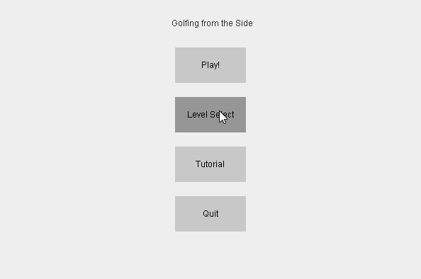

# Golfing from the Side
A side-view golf game with simulated physics built with Java Swing made for my high school AP CSA class. Uses raycasting and sweeping collision detection to ensure near perfect collision detection and resolution.

## Gameplay

  

